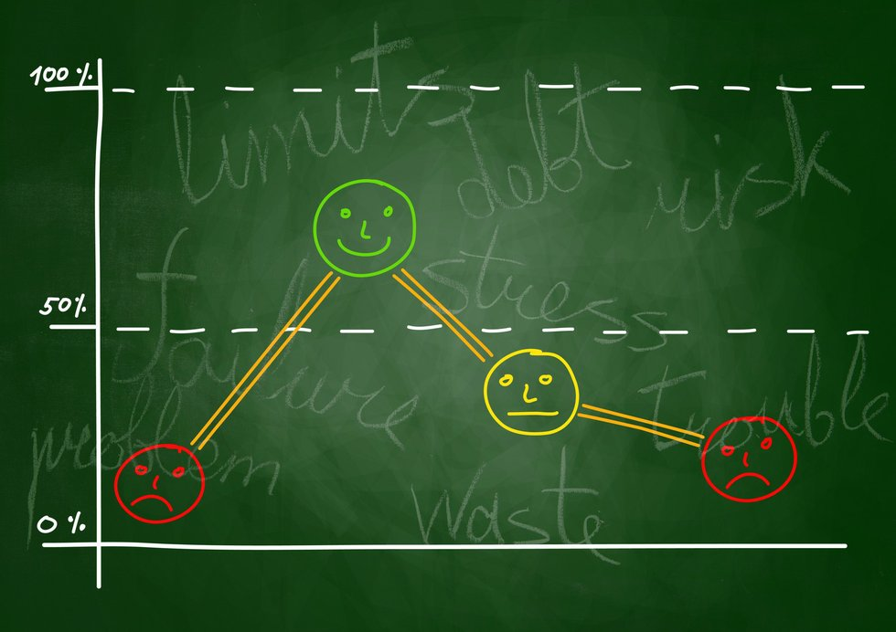

# Crypto Sentiment



## Installation
```bash
# create a new virtual environment and activate it
pip install -r requirements.txt
python -m spacy download en_core_web_sm
```

## Background

With the growing popularity of cryptocurrencies, it would be great to analyse the latest news headlines regarding Bitcoin and Ethereum to get a better feel for the current public sentiment.

This project applies natural language processing to understand the sentiment in the latest news articles featuring Bitcoin and Ethereum.
Fundamental NLP techniques will be used to better understand the other factors involved with the coin prices such as common words and phrases and organizations and entities mentioned in the articles.

## Summary of Findings

### 1 - Sentiment Analysis

Using the [newsapi](https://newsapi.org/) the latest news articles for Bitcoin and Ethereum were downloaded and used to create a DataFrame of sentiment scores for each coin.

> Q: Which coin had the highest mean positive score?

Bitcoin (0.05385) has a lower mean positive score than Ethereum (0.0692)

> Q: Which coin had the highest compound score?

Bitcoin had the highest compound score of 0.886 compared to Ethereum which had a score of 0.7964

> Q: Which coin had the highest negative score?

Bitcoin has the highest negative score of 0.173 compared to Ethereum which had a score of 0.121

> Q: Which coin had the highest positive score?

Bitcoin has the highest positive score of 0.251 compared to Ethereum which had a score of 0.207

### 2 - Natural Language Processing

#### N-grams

The top 10 words for Bitcoin:
1. bitcoin
2. market
3. cryptocurrency
4. one
5. money
6. world
7. year
8. million
9. could
10. investor

The top 10 words for Ethereum:
1. market
2. year
3. cryptocurrency
4. bitcoin
5. crypto
6. go
7. value
8. coin
9.  friday
10. past

#### Word Clouds

Word clouds for each coin were generated to summarize the news for each coin.

**Bitcoin Word Cloud**


**Ethereum Word Cloud**


### 3 - Named Entity Recognition

Named entity recognition models were built for both coins.
The tags were then visualized using SpaCy.


